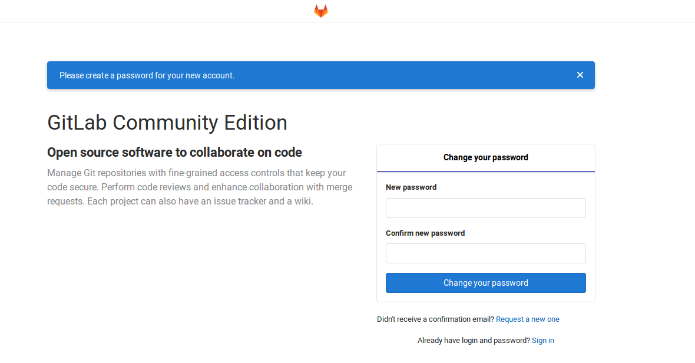

# [Docker]GitLab使用

参考：

[GitLab Docker images](https://docs.gitlab.com/omnibus/docker/)

[gitlab docker Web界面打开反应迟钝的解决办法](https://blog.csdn.net/happyfreeangel/article/details/88653846)

[GitLab Docker 容器的内存优化之路](https://www.imooc.com/article/48668)

[gitlab的docker安装,非标准端口，如何处理？](https://www.cnblogs.com/aguncn/p/10336175.html)

`gitlab`提供了官方镜像 - [gitlab/gitlab-ce](https://hub.docker.com/r/gitlab/gitlab-ce/)

## 启动容器

运行以下命令启动容器

```
$ docker run --detach \
  --publish 7010:7010 \
  --publish 7020:22 \
  --name gitlab \
  --restart always \
  --volume /srv/gitlab/config:/etc/gitlab \
  --volume /srv/gitlab/logs:/var/log/gitlab \
  --volume /srv/gitlab/data:/var/opt/gitlab \
  gitlab/gitlab-ce:latest
```

等待容器状态从`Up 1 second (health: starting)`变为`Up 3 minutes (healthy)`

* 绑定`7010`端口（作用于后续的`external_url`）
* 绑定主机`7020`端口到容器`22`端口
* 挂载主机`/srv/gitlab`文件夹到容器
    - `/etc/gitlab：Gitlab`配置文件
    - `/var/log/gitlab`：日志
    - `/var/opt/gitlab`：应用数据

## 设置external_url

进入`gitlab`容器

```
$ docker exec -it COMTAINER_ID bash
```

修改配置文件`/etc/gitlab/gitlab.rb`，添加`external_url`属性

```
external_url 'http://IP_ADDRESS:7010'          # 指定IP地址，设置访问地址
nginx['listen_port'] = 7010
gitlab_rails['gitlab_shell_ssh_port'] = 7020
```

在容器内部重启`gitlab`服务

```
$ gitlab-ctl reconfigure
$ gitlab-ctl restart
```

*也可以退出系统后，重新启动容器*

```
$ docker restart CONTAINER_ID
```

等待容器状态从`Restarting (1) 19 seconds ago`到`Up 18 minutes (healthy)`

启动浏览器登录`http://localhost:7010`



## [问题]容器一直重启

使用`docker logs`命令查询

```
$ docker log CONTAINER_ID
...
...
System Info:
------------
chef_version=14.13.11
platform=ubuntu
platform_version=16.04
ruby=ruby 2.6.3p62 (2019-04-16 revision 67580) [x86_64-linux]
program_name=/opt/gitlab/embedded/bin/chef-client
executable=/opt/gitlab/embedded/bin/chef-client


Running handlers:
There was an error running gitlab-ctl reconfigure:

/etc/gitlab/gitlab.rb:1: unexpected fraction part after numeric literal
external_url = 192.168.0.144:7002
               ^~~~~~~
/etc/gitlab/gitlab.rb:1: syntax error, unexpected tINTEGER, expecting end-of-input
external_url = 192.168.0.144:7002
                         ^~~

Running handlers complete
Chef Client failed. 0 resources updated in 01 seconds
```

发现是`external_url`配置失误导致。解决方法如下：

1. 停止`gitlab`容器
2. 修改配置文件（在主机中）`/srv/gitlab/config/gitlab.rb`
3. 重新启动容器