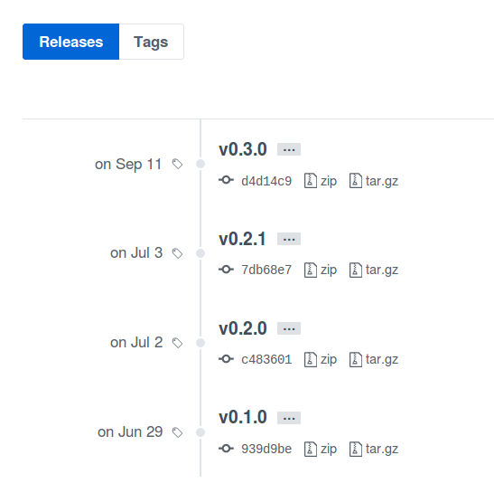
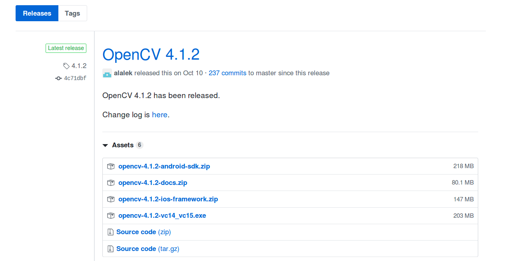

# [GitHub]版本发布

之前通过本地进行版本标记，然后上传到`github`，在`release`页面能够查询到相应的版本。参考[标签设置](https://zj-git-guide.readthedocs.io/zh_CN/latest/basic/%E6%A0%87%E7%AD%BE%E8%AE%BE%E7%BD%AE.html)

但是查看其他的`github`项目的`release`页面，发现发布的版本中还包含了多个压缩文件（比如`Windows/Linux/MacOS`），可以单独下载

学习`GitHub`文档[About releases](https://help.github.com/en/github/administering-a-repository/about-releases)和[Creating releases](https://help.github.com/en/github/administering-a-repository/creating-releases)后发现必须通过**在线标签设置**的方式才能额外上传单独的压缩文件