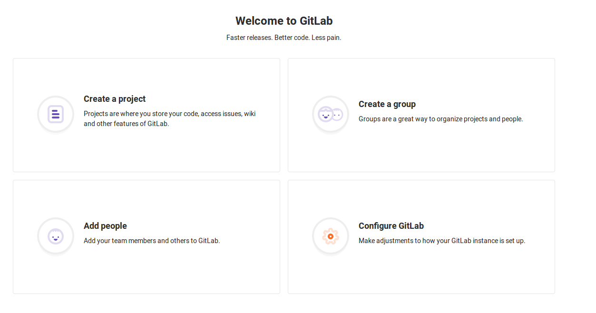
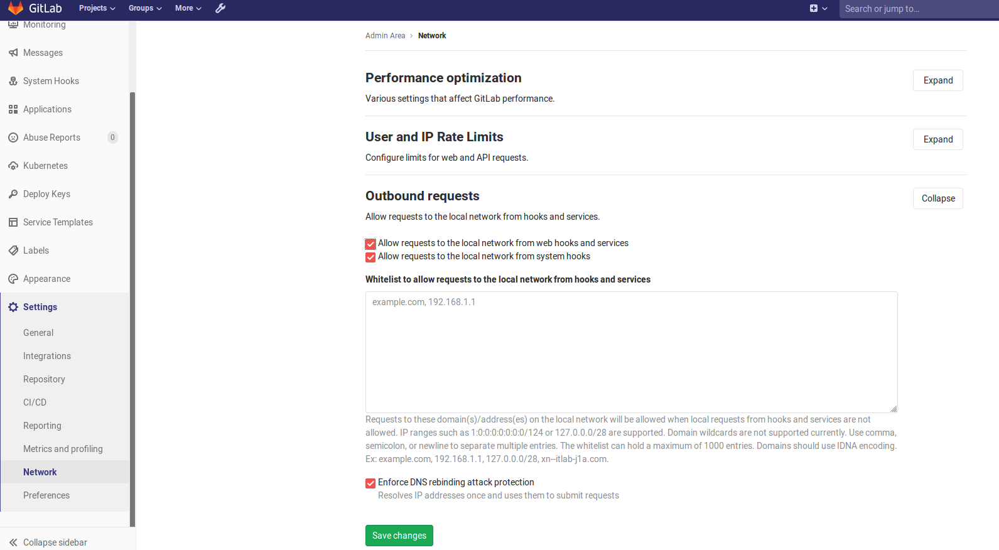

# [GitLab][Webhook]不允许本地连接

在`gitlab`仓库中设置`Webhook`，使用本地连接出现如下错误:

```
Url is blocked: Requests to the local network are not allowed
```

参考:[gitlab使用webhook向jenkins发送请求，报错 Requests to the local network are not allowed](https://blog.csdn.net/xukangkang1hao/article/details/80756085)

登录`root`账户，点击`Configure Gitlab`选项



进入`Settings -> Network`，展开`Outbound requests`，选中`Allow requests to the local network from web hooks and services`

