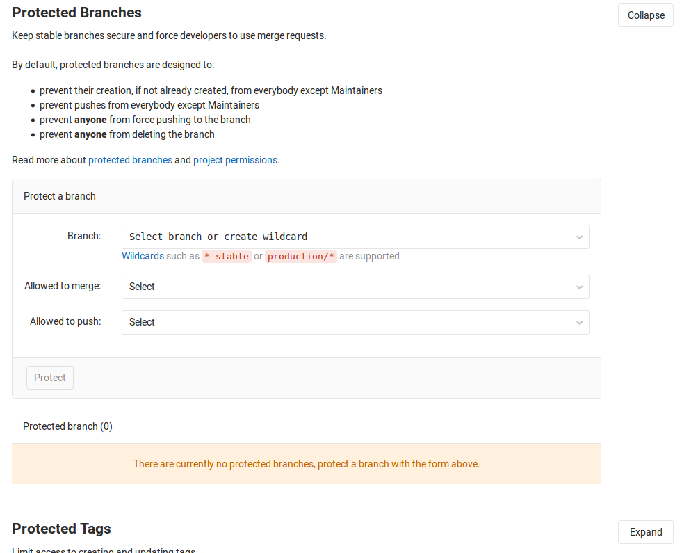

# [GitLab]受保护分支

强制上传代码到`Gitlab`仓库的`dev`分支出错，提示如下：

```
GitLab: You are not allowed to force push code to a protected branch on this project
```

参考：[解决 GitLab: You are not allowed to force push code to a protected branch on this project问题](https://blog.csdn.net/mqdxiaoxiao/article/details/95794053)

是由于分支保护的原因，需要进入仓库`setting -> Repository -> Protected Branches`



允许`dev`分支能够强制推送