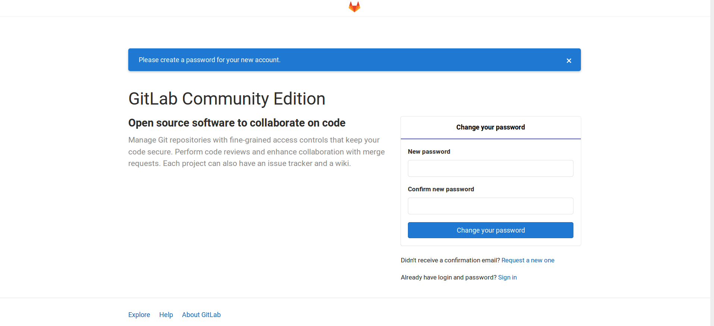

# [GitLab]安装

## 硬件配置

参考：[Requirements](https://docs.gitlab.com/ce/install/requirements.html#hardware-requirements)

官方推荐的硬件配置为：

1. `2 cores CPU`
2. `8GB RAM`

## 安装

进入[gitlab/gitlab-ce](https://packages.gitlab.com/gitlab/gitlab-ce)查询

首先安装依赖项

```
$ curl -s https://packages.gitlab.com/install/repositories/gitlab/gitlab-ce/script.deb.sh | sudo bash
Detected operating system as Ubuntu/xenial.
Checking for curl...
Detected curl...
Checking for gpg...
Detected gpg...
Running apt-get update... done.
Installing apt-transport-https... done.
Installing /etc/apt/sources.list.d/gitlab_gitlab-ce.list...done.
Importing packagecloud gpg key... done.
Running apt-get update... done.

The repository is setup! You can now install packages.
```

然后安装`gitlab-ce`

```
# 当前是ubuntu 16.04
$ sudo apt-get install gitlab-ce
```

*也可以下载.deb包后安装*

```
$ sudo dpkg -i gitlab-ce_12.3.5-ce.0_amd64.deb 
Selecting previously unselected package gitlab-ce.
(Reading database ... 368157 files and directories currently installed.)
Preparing to unpack gitlab-ce_12.3.5-ce.0_amd64.deb ...
Unpacking gitlab-ce (12.3.5-ce.0) ...
Setting up gitlab-ce (12.3.5-ce.0) ...
It looks like GitLab has not been configured yet; skipping the upgrade script.

       *.                  *.
      ***                 ***
     *****               *****
    .******             *******
    ********            ********
   ,,,,,,,,,***********,,,,,,,,,
  ,,,,,,,,,,,*********,,,,,,,,,,,
  .,,,,,,,,,,,*******,,,,,,,,,,,,
      ,,,,,,,,,*****,,,,,,,,,.
         ,,,,,,,****,,,,,,
            .,,,***,,,,
                ,*,.
  


     _______ __  __          __
    / ____(_) /_/ /   ____ _/ /_
   / / __/ / __/ /   / __ `/ __ \
  / /_/ / / /_/ /___/ /_/ / /_/ /
  \____/_/\__/_____/\__,_/_.___/
  

Thank you for installing GitLab!
GitLab was unable to detect a valid hostname for your instance.
Please configure a URL for your GitLab instance by setting `external_url`
configuration in /etc/gitlab/gitlab.rb file.
Then, you can start your GitLab instance by running the following command:
  sudo gitlab-ctl reconfigure

For a comprehensive list of configuration options please see the Omnibus GitLab readme
https://gitlab.com/gitlab-org/omnibus-gitlab/blob/master/README.md
```

## 系统配置

打开文件`/etc/gitlab/gitlab.rb`，修改external_url为自己的地址

```
$ sudo cat /etc/gitlab/gitlab.rb | grep external_url
[sudo] password for zj: 
Sorry, try again.
[sudo] password for zj: 
##! For more details on configuring external_url see:
##external_url 'http://gitlab.example.com'
external_url 'http://localhost:8800'
...
...
```

重新进行gitlab配置

```
$ sudo gitlab-ctl reconfigure
Starting Chef Client, version 14.13.11
resolving cookbooks for run list: ["gitlab"]
Synchronizing Cookbooks:
  - gitlab (0.0.1)
  - package (0.1.0)
  - redis (0.1.0)
  - postgresql (0.1.0)
  - monitoring (0.1.0)
  - registry (0.1.0)
  - mattermost (0.1.0)
  - consul (0.1.0)
  - gitaly (0.1.0)
  - letsencrypt (0.1.0)
  - nginx (0.1.0)
  - runit (4.3.0)
  - crond (0.1.0)
  - acme (4.0.0)
Installing Cookbook Gems:
Compiling Cookbooks...
...
...
Running handlers:
Running handlers complete
Chef Client finished, 526/1417 resources updated in 02 minutes 32 seconds
gitlab Reconfigured!
```

登录修改后的网址：`http://localhost:8800`



管理员`root`的密码设置完成后就自动跳转到登录页面

可以直接使用`root`用户登录，也可以注册一个新帐号

