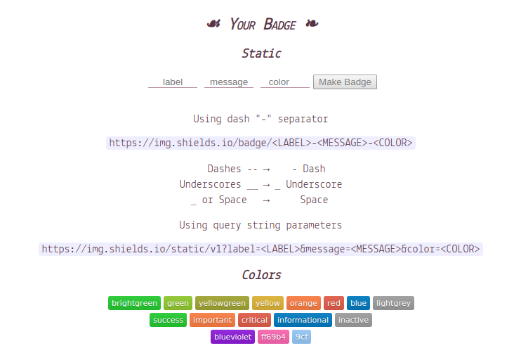

# 徽章

经常在`README`文件中发现许多徽章，很多都是使用[http://shields.io](http://shields.io/)或类似服务创建和托管的

## 自定义

进入`shields.io`



输入标签名和徽章信息，选择颜色即可生成静态`SVG`图像

```
https://img.shields.io/badge/ZHUJIAN-BADGE-brightgreen
```


## 添加链接

在徽章图像上添加链接，点击图像跳转到仓库

```
[](https://shields.io)
```

[](https://shields.io)