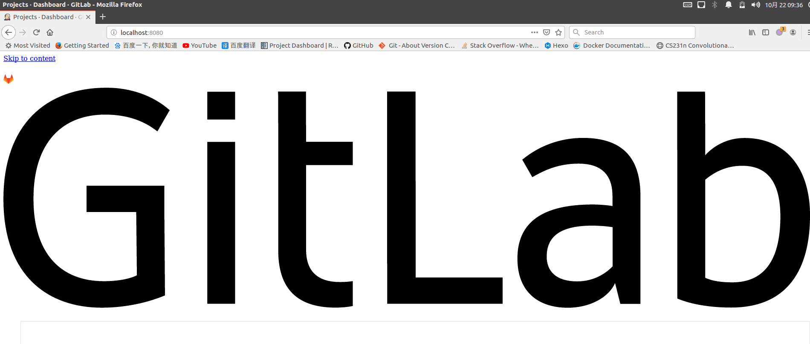
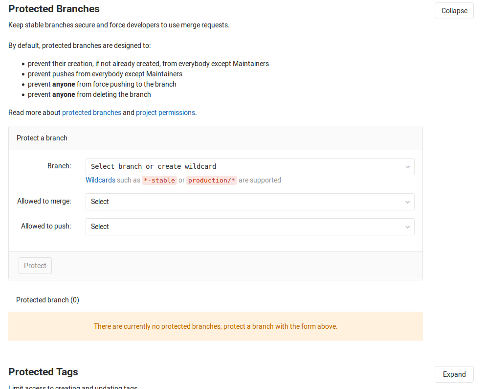

# 问题解答

## 问题一：GitLab容器一直重启


使用`docker logs`命令查询

```
$ docker log CONTAINER_ID
...
...
System Info:
------------
chef_version=14.13.11
platform=ubuntu
platform_version=16.04
ruby=ruby 2.6.3p62 (2019-04-16 revision 67580) [x86_64-linux]
program_name=/opt/gitlab/embedded/bin/chef-client
executable=/opt/gitlab/embedded/bin/chef-client


Running handlers:
There was an error running gitlab-ctl reconfigure:

/etc/gitlab/gitlab.rb:1: unexpected fraction part after numeric literal
external_url = 192.168.0.144:7002
               ^~~~~~~
/etc/gitlab/gitlab.rb:1: syntax error, unexpected tINTEGER, expecting end-of-input
external_url = 192.168.0.144:7002
                         ^~~

Running handlers complete
Chef Client failed. 0 resources updated in 01 seconds
```

发现是`external_url`配置失误导致。解决方法如下：

1. 停止`gitlab`容器
2. 修改配置文件（在主机中）`/srv/gitlab/config/gitlab.rb`
3. 重新启动容器

## 问题二：GitLab导致8080端口冲突

* 问题复现

安装完`GitLab`后，修改配置文件`/etc/gitlab/gitlab.rb`

```
##external_url 'http://gitlab.example.com'
external_url 'http://localhost:8800'
```

本以为这样就能修改`GitLab`端口号为`8800`了，没想到再次登录`8080`仍旧出现了`GitLab`页面



* 问题解析

查询哪个程序监听了`8080`端口

```
# netstat -lnp | grep 8080
tcp        0      0 127.0.0.1:8080          0.0.0.0:*               LISTEN      26436/config.ru 
```

查询相应的进程

```
# netstat -lnp | grep 26436
tcp        0      0 127.0.0.1:8080          0.0.0.0:*               LISTEN      26436/config.ru 
unix  2      [ ACC ]     STREAM     LISTENING     343538   26436/config.ru     /var/opt/gitlab/gitlab-rails/sockets/gitlab.socket
```

仍然是`GitLab`在监听`8080`端口，参考[gitlab 8.13 80 8080端口冲突问题](https://blog.csdn.net/vbaspdelphi/article/details/52979836)，查看配置文件`unicorn.rb`

```
# This file is managed by gitlab-ctl. Manual changes will be
# erased! To change the contents below, edit /etc/gitlab/gitlab.rb
# and run `sudo gitlab-ctl reconfigure`.

# What ports/sockets to listen on, and what options for them.
listen "127.0.0.1:8080", :tcp_nopush => true
```

默认情况下`unicorn`同样监听`8080`端口，查询`/etc/gitlab/gitlab.rb`中相应的设置

```
# cat gitlab.rb | grep unicorn
#unicorn['port'] = 8800
```

* 解决方案

需要在`gitlab.rb`上同时修改`unicorn`监听端口号，修改配置文件`/etc/gitlab/gitlab.rb`如下

```
##external_url 'http://gitlab.example.com'
external_url 'http://localhost:8800'
unicorn['port'] = 8801
```

重新启动`GitLab`

```
# gitlab-ctl reconfigure
# gitlab-ctl restart
```

查询配置文件`/var/opt/gitlab/gitlab-rails/etc/unicorn.rb`

```
# cat unicorn.rb | grep listen
# What ports/sockets to listen on, and what options for them.
listen "127.0.0.1:8801", :tcp_nopush => true
```

测试端口号

```
$ curl localhost:8080
curl: (7) Failed to connect to localhost port 8080: Connection refused
$ curl localhost:8800
<!DOCTYPE html>
<html>
<head>
  <meta content="width=device-width, initial-scale=1, maximum-scale=1" name="viewport">
...
...
# curl localhost:8801
<html><body>You are being <a href="http://localhost:8801/users/sign_in">redirected</a>.</body></html>
```

## 问题三： [GitLab][Webhook]不允许本地连接

在`gitlab`仓库中设置`Webhook`，使用本地连接出现如下错误:

```
Url is blocked: Requests to the local network are not allowed
```

参考:[gitlab使用webhook向jenkins发送请求，报错 Requests to the local network are not allowed](https://blog.csdn.net/xukangkang1hao/article/details/80756085)

登录`root`账户，点击`Configure Gitlab`选项


进入`Settings -> Network`，展开`Outbound requests`，选中`Allow requests to the local network from web hooks and services`


## 问题四：GitLab: You are not allowed to force push code to a protected branch on this project

强制上传代码到`Gitlab`仓库的`dev`分支出错，提示如下：

```
GitLab: You are not allowed to force push code to a protected branch on this project
```

参考：[解决 GitLab: You are not allowed to force push code to a protected branch on this project问题](https://blog.csdn.net/mqdxiaoxiao/article/details/95794053)

是由于分支保护的原因，需要进入仓库`setting -> Repository -> Protected Branches`



允许`dev`分支能够强制推送

## 问题五：unicorn出错

* 问题描述

通过`docker`部署`gitlab`一段时间后，突然出现`502`错误

查看容器状态，显示不健康

```
CONTAINER ID        IMAGE                     COMMAND                  CREATED             STATUS                 PORTS                                                           NAMES
89481faa2ed1        gitlab/gitlab-ce:latest   "/assets/wrapper"        2 weeks ago         Up 7 hours (unhealthy)
```

浏览容器日志，发现如下错误：

```
==> /var/log/gitlab/unicorn/unicorn_stdout.log <==
bundler: failed to load command: unicorn (/opt/gitlab/embedded/bin/unicorn)

==> /var/log/gitlab/unicorn/unicorn_stderr.log <==
ArgumentError: Already running on PID:460 (or pid=/opt/gitlab/var/unicorn/unicorn.pid is stale)
  /opt/gitlab/embedded/lib/ruby/gems/2.6.0/gems/unicorn-5.4.1/lib/unicorn/http_server.rb:205:in `pid='
  /opt/gitlab/embedded/lib/ruby/gems/2.6.0/gems/unicorn-5.4.1/lib/unicorn/http_server.rb:137:in `start'
  /opt/gitlab/embedded/lib/ruby/gems/2.6.0/gems/unicorn-5.4.1/bin/unicorn:126:in `<top (required)>'
  /opt/gitlab/embedded/bin/unicorn:23:in `load'
  /opt/gitlab/embedded/bin/unicorn:23:in `<top (required)>'

==> /var/log/gitlab/unicorn/current <==
2019-12-18_12:27:47.34406 failed to start a new unicorn master
2019-12-18_12:27:47.35882 starting new unicorn master
2019-12-18_12:27:47.91735 master failed to start, check stderr log for details
```

* 问题解析

看样子是`unicorn`的问题，参考：

[gitlab服务器502恢复过程](https://blog.csdn.net/zhouchuan152/article/details/95871798)

[gitlab docker Web界面打开反应迟钝的解决办法](https://blog.csdn.net/happyfreeangel/article/details/88653846)

进入容器内部，查看`unicorn`状态

```
$ docker exec -it xxxx bash
# gitlab-ctl tail unicorn
```

发现每次`unicorn`显示的`PID`都不同，修改`/etc/gitlab/gitlab.rb`，添加

```
unicorn['listen'] = 'localhost'
unicorn['port'] = 8999
```

更新并重启后，`gitlab`服务恢复正常

```
# gitlab-ctl reconfigure
# gitlab-ctl restart
```

## 问题六：版本更新后database出错

* 问题描述

拉取了最新的`Docker Gitlab`镜像，部署时发现了如下错误：

```
gitlab     |     System Info:
gitlab     |     ------------
gitlab     |     chef_version=14.14.29
gitlab     |     platform=ubuntu
gitlab     |     platform_version=16.04
gitlab     |     ruby=ruby 2.6.6p146 (2020-03-31 revision 67876) [x86_64-linux]
gitlab     |     program_name=/opt/gitlab/embedded/bin/chef-client
gitlab     |     executable=/opt/gitlab/embedded/bin/chef-client
gitlab     |     
gitlab     | 
gitlab     | Running handlers:
gitlab     | There was an error running gitlab-ctl reconfigure:
gitlab     | 
gitlab     | bash[migrate gitlab-rails database] (gitlab::database_migrations line 55) had an error: Mixlib::ShellOut::ShellCommandFailed: Expected process to exit with [0], but received '1'
gitlab     | ---- Begin output of "bash"  "/tmp/chef-script20200618-23-sfpkhu" ----
gitlab     | STDOUT: rake aborted!
gitlab     | PG::ConnectionBad: could not connect to server: No such file or directory
gitlab     | 	Is the server running locally and accepting
gitlab     | 	connections on Unix domain socket "/var/opt/gitlab/postgresql/.s.PGSQL.5432"?
gitlab     | /opt/gitlab/embedded/service/gitlab-rails/lib/tasks/gitlab/db.rake:48:in `block (3 levels) in <top (required)>'
gitlab     | /opt/gitlab/embedded/bin/bundle:23:in `load'
gitlab     | /opt/gitlab/embedded/bin/bundle:23:in `<main>'
gitlab     | Tasks: TOP => gitlab:db:configure
gitlab     | (See full trace by running task with --trace)
gitlab     | STDERR: 
gitlab     | ---- End output of "bash"  "/tmp/chef-script20200618-23-sfpkhu" ----
gitlab     | Ran "bash"  "/tmp/chef-script20200618-23-sfpkhu" returned 1
```

* 问题解决

在网上查了一些资料，说是新旧版本的配置格式不一致，需要删除之前的配置数据。幸好在本地保存了之前使用的镜像，打包该镜像后上传到服务器重新加载即可

## 问题七：Prometheus吃磁盘空间


在云服务器上部署`Gitlab`，今天发现无法登录了。登上云服务器后发现磁盘容量没有了，通过查找发现`Prometheus`目录下占据了`30GB`的空间（总共`50GB`）

参考：

[Monitoring GitLab with Prometheus](https://docs.gitlab.com/ee/administration/monitoring/prometheus/)

[Prometheus eats disk space in /var/opt/gitlab/prometheus/data](https://gitlab.com/gitlab-org/omnibus-gitlab/-/issues/4166)

[GitLab 官方镜像内部集成 Prometheus 历史数据过大的问题处理](https://lakelight.net/2020/03/24/GitLab-Prometheus-clean.html)

`Prometheus`是一个监控服务，会保存历史监控数据，下面尝试关闭该服务并删除之前的数据（在`Docker Gitlab`上操作）

1. 修改配置文件`/srv/gitlab/config/gitlab.rb`，添加

```
prometheus_monitoring['enable'] = false
```

2. 关闭`gitlab`并删除`/srv/gitlab/data/prometheus`文件夹数据

3. 重启`gitlab`，问题解决

## 问题八：Access deined: You do not have permission push to this repository

在gitee上新建了一个账户，在上面新建一个仓库，将其ssh链接设置到本地已存在的仓库上，想要把本地仓库推送到远程仓库，出现如下错误：

```
$ git push origin master 
Access deined: You do not have permission push to this repository
fatal: 无法读取远程仓库。

请确认您有正确的访问权限并且仓库存在。
```

其原因在于本地新建了两个`ssh`密钥，设置在`gitee`的不同账户上，ssh使用之前的密钥读取gitee远程仓库，导致出错。参考[如何使用特定的SSH Key提交GIT](https://www.jianshu.com/p/82aa1678411e)

在`~/.ssh/config`文件上添加如下内容

```
Host gitee.com
	HostName gitee.com
	User git
	IdentityFile 私钥文件路径
	IdentitiesOnly yes
```

重新提交即可

## 问题九：代码库大小限制

* 问题描述

上传代码到`Gitee`时，打印出如下日志：

```
 git push --force git@gitee.com:xx.xx.git master
remote: Powered by GITEE.COM [GNK-3.8]        
remote: Recommended to reduce the repository size        
remote: This repository(including wiki) size 581.64 MB exceeds 500.00 MB        
remote: HelpLink: https://gitee.com/help/articles/4232
To gitee.com:zjZSTU/xx.xxx.git
```

在网上查询发现是因为单个仓库大小超出了限制（`500MB`），经过一番查询发现`Gitee`和`Coding`的个人仓库都限制在`500MB`，`Github`对单个仓库大小的限制为`1GB`。

* 问题解决

阿里云的单个仓库限制为`2GB`，能够满足当前需求。

各个远程`Git`仓库服务器的官网地址如下：

1. [Gitee](https://gitee.com/)
2. [Coding](https://coding.net/)
3. [Github](https://github.com/)
4. [Aliyun Code](https://code.aliyun.com)

* 相关阅读

[Gitee 仓库体积过大，如何减小？ ](https://gitee.com/help/articles/4232#article-header0)

[Tencent 仓库大小限制吗？](https://cloud.tencent.com/developer/ask/197652)

[GitHub File and repository size limitations](https://help.github.com/en/github/managing-large-files/what-is-my-disk-quota#file-and-repository-size-limitations)

[Aliyun代码库对文件大小是否有限制？](https://help.aliyun.com/document_detail/153791.html?spm=5176.11065259.1996646101.searchclickresult.30c1183bbCmNS7)

## 问题十：publickey denied

`ssh`连接失败，这个问题很迷，耗了`1`天时间，网上找了很多资料没有结果，有一个博客主也遇到了同样的问题，他最后解决是因为突然就可以了，我也一样

## 问题十一：git is not in the sudoers file.  This incident will be reported.

是因为`git`没有添加到`sudo`权限，参考[xxx is not in the sudoers file.This incident will be reported.的解决方法](https://www.cnblogs.com/xiaochaoyxc/p/6206481.html)

1. 先切换到`ubuntu`用户

        $ su ubuntu

2. 赋予`sudo`文件写权限

        $ sudo chmod u+w /etc/sudoers

3. 修改文件`/etc/sudoers`

        $ sudo vim /etc/sudoers
        # 添加
        youuser ALL=(ALL) ALL

    表示允许用户`youuser`执行`sudo`命令(需要输入密码)

4. 撤销`sudo`文件写权限

        $ sudo chmod u-w /etc/sudoers

5. 重新切换回原来用户

        $ su git

## 问题十二：perl: warning: Falling back to a fallback locale ("en_US.utf8").

```
$ sudo adduser zhujian
perl: warning: Setting locale failed.
perl: warning: Please check that your locale settings:
    LANGUAGE = (unset),
    LC_ALL = (unset),
    LC_MEASUREMENT = "zh_CN.UTF-8",
    LC_PAPER = "zh_CN.UTF-8",
    LC_MONETARY = "zh_CN.UTF-8",
    LC_NAME = "zh_CN.UTF-8",
    LC_ADDRESS = "zh_CN.UTF-8",
    LC_NUMERIC = "zh_CN.UTF-8",
    LC_TELEPHONE = "zh_CN.UTF-8",
    LC_IDENTIFICATION = "zh_CN.UTF-8",
    LC_TIME = "zh_CN.UTF-8",
    LANG = "en_US.utf8"
    are supported and installed on your system.
perl: warning: Falling back to a fallback locale ("en_US.utf8").
Adding user `zhujian'ssh-rsa AAAAB3NzaC1yc2EAAAADAQABAAABAQC+VVpw5kOZBmzJYz/vngYpAAV61Fq9oChSflQFkfzr1sKHRqq2/sqeZD3gzPQZbrKWcHbuGCWyQOvm1gH+67gW+TpUO9DWeeHqo3h5rlCW+ElJcL/q4b+ZBVEmGDjzE+Sg+6wM+izBl5xzHDFeLhN3Yw1OVc2rwQFQ/CD6FSKdL4b5bt0/5rpu65sv7haXjfDMSEsIVgPY5behLzZzoXy81iN4/tPF3cjDsn/x5Yywc60LdslJ5hW5wlozhq1LibUXk9JQu/+5DDZKi8ytMEoe1S7yROvaC/ofJQR22hINnFoLNBC8gSFM2YR+t9oBF0eiAaVwfgddA0+ScYrWA5Yr zj@zj-ThinkPad-T470p ...
Adding new group `zhujian' (1000) ...
Adding new user `zhujian' (1000) with group `zhujian' ...
Creating home directory `/home/zhujian' ...
...
...
```

提示语言包问题，参考[perl: warning: Falling back to a fallback locale ("en_US.UTF-8")](https://blog.csdn.net/jmpjmpkiss/article/details/55098794)

    $ sudo apt install locales-all

## 问题十三：`remote: error: cannot lock ref 'refs/heads/master': ref refs/heads/master`

在`Travis CI`上上传文件到远程仓库，出现如下问题

    remote: error: cannot lock ref 'refs/heads/master': ref refs/heads/master

* 起因

我在上传提交时中间中断了

    $ git push -u origin dev
    Counting objects: 6, done.
    Delta compression using up to 8 threads.
    Compressing objects: 100% (6/6), done.
    Writing objects: 100% (6/6), 556 bytes | 0 bytes/s, done.
    Total 6 (delta 5), reused 0 (delta 0)
    remote: Resolving deltas: 100% (5/5), completed with 5 local objects.
    ^C

然后再更新文章后再一次提交，就出现了远程仓库锁定的问题

* 解决

参考：[git: error: cannot lock ref, error: cannot lock ref](https://blog.csdn.net/sinat_36246371/article/details/79959598)

将远程仓库下载到本地，然后执行如下命令

    git remote prune origin

其作用是同步本地远程分支，删除本地已过时的远程分支

重新触发`CI`工具执行，此时能够成功更新了

## 问题十四：error: RPC failed; curl 56 GnuTLS recv error (-9)

* 问题描述

下载`Github`仓库时出现如下错误

```
remote: Enumerating objects: 150, done.
remote: Counting objects: 100% (150/150), done.
remote: Compressing objects: 100% (90/90), done.
error: RPC failed; curl 56 GnuTLS recv error (-9): A TLS packet with unexpected length was received.
fatal: The remote end hung up unexpectedly
fatal: 过早的文件结束符（EOF）
fatal: index-pack 失败
```

* 解析

参考[git error: RPC failed; curl 56 GnuTLS](https://stackoverflow.com/questions/38378914/git-error-rpc-failed-curl-56-gnutls)和[Git 克隆错误‘RPC failed; curl 56 Recv failure....’ 及克隆速度慢问题解决](https://blog.csdn.net/qq_34121797/article/details/79561110)，有可能是`http缓存不够`或者`网络不稳定`问题

* 对于网络不稳定问题

>Rebuilding git with openssl instead of gnutls fixed my problem.

* 对于`http`缓存不够

```
# httpBuffer加大    
$ git config --global http.postBuffer 524288000
```

* 解决

重新设置了`http`缓存，不过最后是通过码云的方式解决的

1. 先将`Github`仓库拉取到码云仓库
2. 在从码云上下载

## 问题十五：fatal: 无法读取远程仓库。

```
$ git clone ssh://git@gitlab.zhujian.tech:7020/zjykzj/hexo-blog.git
正克隆到 'hexo-blog'...
remote: 
remote: ========================================================================
remote: 
remote: The project you were looking for could not be found.
remote: 
remote: ========================================================================
remote: 
fatal: 无法读取远程仓库。

请确认您有正确的访问权限并且仓库存在。
```

参考：[How to fix 'The project you were looking for could not be found' when using git clone](https://stackoverflow.com/questions/54571213/how-to-fix-the-project-you-were-looking-for-could-not-be-found-when-using-git)

添加私钥

```
eval "$(ssh-agent -s)"

ssh-add ~/.ssh/<id_rsa>
```

## 问题十六：fatal: 无法读取远程仓库。

```
$ git push origin master 
ssh: connect to host ssh.github.com port 443: Connection timed out
fatal: 无法读取远程仓库。

请确认您有正确的访问权限并且仓库存在。
```

1. 激活私钥
2. 测试远程登录
3. 代理（推荐）

参考：[git上传代码报错ssh: connect to host github.com port 22: Connection timed out解决办法](https://blog.csdn.net/qq_42146613/article/details/82772734)

## 问题十七：gnutls_handshake() failed: Error in the pull function

参考：[使用curl出现gnutls_handshake() failed: Error in the pull function或者GnuTLS recv error: Error in the pull](https://blog.csdn.net/anlian523/article/details/90729063)

* 方法一：`sudo apt-get install libcurl4-openssl-dev`
* 方法二：开启代理（推荐）

## 问题十八：Host key verification failed.

```
+ git push --force ssh://git@gitlab.zhujian.tech:7020/****/test.git master
Host key verification failed.
fatal: Could not read from remote repository.

Please make sure you have the correct access rights
and the repository exists.
```

在网上找了很多资料，提出的解决方案是重新设置`ssh`公/私钥。当前我的问题不是这个，而是`.ssh/config`重新配置

```
Host <xxx/自定义gitlab地址>
        Port xxx                                   ---------------> 这个是关键，默认为22，当前应该设置为7020
        StrictHostKeyChecking no
```